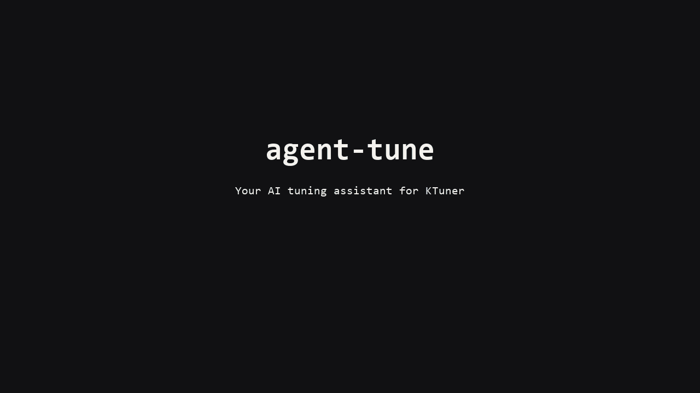

<p align="center">
  <a href="https://vehra.net">
    <picture>
      <source media="(prefers-color-scheme: dark)" srcset="docs/brand/vehra-logo-reversed.svg">
      
    </picture>
  </a>
</p>

# agent-tune

**Tune your car with KTuner and an AI assistant.**

A [VEHRA](https://vehra.net) project.

[](https://github.com/VehraLabs/agent-tune/actions/workflows/test.yml)
[](LICENSE)
[](pyproject.toml)

KTuner lets you change almost anything in your car's ECU. Knowing what to change is the hard
part, and usually that means paying a tuner.

agent-tune does the tuner's homework. Record a few full-throttle runs with KTuner and give the
log to your AI assistant. It checks for knock, compares the fuel and ignition timing your engine
actually got with what makes power, and comes back with specific edits: which table, which
cells, from what value to what. Say yes, and agent-tune writes them into a new tune file. You
open it in KTuner, look it over, and flash it. Then you drive the same runs again and see what
changed.

It never flashes the car and never touches your original tune file.



> agent-tune works with KTuner hardware and the KTuner app. It is not affiliated with or
> endorsed by KTuner.

## What you need

* A Honda with a KTuner, and the KTuner app on a Windows laptop.
* An AI assistant that can use skills or MCP, such as Claude Code or Codex. Optional:
  every step also works as a command.

## Get started

Install it with [uv](https://docs.astral.sh/uv/) (needs Python 3.11 or newer):

```bash
uv tool install "vehra-agent-tune[mcp]"
```

The package is called `vehra-agent-tune` on PyPI; the command it installs is `agent-tune`.
Leave out `[mcp]` if you won't connect an AI assistant. To install the latest development
version instead:

```bash
uv tool install "vehra-agent-tune[mcp] @ git+https://github.com/VehraLabs/agent-tune"
```

### With an AI assistant

Connect it once:

| Assistant | How to connect |
|---|---|
| Assistants that use skills (Claude Code, Codex, ...) | Copy [`skills/agent-tune`](skills/agent-tune) into your assistant's skills folder. |
| Assistants that use MCP | `claude mcp add agent-tune -- agent-tune mcp`, or run `agent-tune mcp` as a stdio server from any MCP client. |
| Anything that can run commands | Call `agent-tune` directly. Every command prints JSON. |

Then ask it something like *"I have a KTuner on my Honda and I want more power. What should I
do first?"* It will tell you how to drive for a log, check what you bring back, and propose
edits for you to approve.

### On your own

```bash
agent-tune guide power                          # how to drive and record for power
agent-tune check-log drive.csv --goal power     # does the log have what's needed?
agent-tune analyze drive.csv --findings         # knock, fuel, timing, room to improve
agent-tune tune check stock.kcl                 # can this tune file be edited?
agent-tune tune set stock.kcl --add "wot-h-6000-600=0.3" -o step-1.kcl --dry-run   # preview an edit
```

Without `--dry-run` it writes `step-1.kcl` and `step-1.manifest.json`, which lists every value
it changed. After flashing and driving the same runs again, `agent-tune compare before.csv
after.csv` shows the difference.

## A few terms

* **Datalog**: a recording of your engine's sensors while you drive. KTuner records it; export
  it to CSV for agent-tune.
* **Full-throttle run** (or pull): accelerating with the pedal all the way down through the rev
  range. This is where power is made, so it's what power tuning looks at.
* **AFR (air-fuel ratio)**: how much air there is for each part of fuel. Lower is richer (more
  fuel). Naturally aspirated engines usually make the most power around 12.5 to 13.2 at full
  throttle.
* **Knock**: uncontrolled combustion that can damage an engine. Any change that causes knock
  gets undone.
* **Ignition timing**: when the spark fires. A little more can add power, but too much causes
  knock.
* **Tune file (`.kcl`)**: the file KTuner flashes to your car. **Flashing** means writing it to
  the car's computer.

## What's supported

| What | Status |
|---|---|
| Reading KTuner datalogs (CSV export): full-throttle runs, knock, AFR, timing, fuel trims, before/after | Every Honda KTuner supports |
| Editing tune files: 1,502 values, including ignition timing, full-throttle fuel (WOT enrichment), intake cam (VTC), VTEC, rev limits, fuel cut, airflow (AFM) curve and cylinder trims | Verified so far on the 64S ECU (Civic 2.0 L, 37805-64S-AC20, KTuner 1.0.14.1 saves). Other ECUs: [check your file](#adding-your-car) |
| Logging live data without the KTuner app | Verified so far on the 64S ECU. Other ECUs: [try it](#adding-your-car) |

When agent-tune records live data itself, it reads RPM, measured and commanded lambda (AFR),
MAF (g/s and Hz), MAP, throttle position and commanded throttle, ignition timing, short and
long-term fuel trims, coolant and intake temperature, speed, gear, intake and exhaust cam angles
(actual and commanded), FP1, battery voltage, knock control and fuel status. These match what
KTuner displays. Knock count and VTEC state are not available that way yet, so record with the
KTuner app when you need them. Any timing change needs the knock count.

### Adding your car

Each new ECU is added once someone confirms it works. Here is how to check yours.

* **Datalogs.** Anything that reads a KTuner CSV export already works on any car. For recording with agent-tune itself, `agent-tune log` keeps every reply the dongle
  sends, including ones it doesn't recognize yet, so they can be matched against a KTuner
  datalog later. You can also give it your own channel layout with `--platform my-car.json`,
  starting from [the bundled file](src/agent_tune/platforms/honda_civic_11g_20_64s.json).
* **Tune files.** `agent-tune tune check your.kcl` says whether your file is from a verified
  family. If not, it checks whether the known layout looks right for it (timing in a sensible
  range, the airflow curve increasing, rev limits in order, and so on). If it does,
  `--unverified` lets you read it and write a test file. Change **one** value, open the new
  file in KTuner, and confirm that exactly that value changed. Files written this way carry a
  warning. Don't flash anything until KTuner shows exactly what you expect.

If it works on your car, open an issue or a pull request with the fingerprint from
`tune check` and your car details so it can be added. [CONTRIBUTING.md](CONTRIBUTING.md) has
the steps. Please never share tune files, VINs or serial numbers.

## Commands

| Command | What it does |
|---|---|
| `guide [power\|cruise\|baseline\|compare]` | Step-by-step instructions for recording a useful datalog: what to press, how to drive, how to export |
| `check-log LOG [--goal GOAL]` | Checks whether a datalog is good enough for the goal, and says what to redo if not |
| `analyze LOG [--findings]` | Reads a datalog the way a tuner would: runs, knock, AFR, timing, fuel trims, heat |
| `compare BEFORE AFTER` | Before and after a change, by RPM: acceleration, AFR, timing, knock |
| `devices` | Finds a connected KTuner dongle |
| `log [--seconds N] [-o FILE] [--platform ID\|FILE.json]` | Records live data with agent-tune (KTuner app closed) |
| `tune check FILE` | Can agent-tune edit this tune file? Plausibility report if it isn't verified |
| `tune tables FILE`, `tune cells FILE [--match PATTERN]` | Shows the current values in a tune file |
| `tune set FILE --set/--add/--scale ID=VALUE -o NEW [--dry-run] [--note TEXT]` | Writes a new tune file with the changes, plus a list of every value changed |
| `suggest --tune FILE LOG...` | Airflow (AFM) curve suggestions; needs two or more drives that agree |
| `platforms` | Cars agent-tune can record live data from, and the values it reads |
| `mcp` | Runs the MCP server for AI assistants |

Value ids look like `ign-max-h-6000-100` (table, cam, RPM, column) and accept wildcards such as
`wot-h-6000-*`. Add `--unverified` to `tune` commands for a file outside the verified families.
`tune set` never overwrites the file you start from.

## Safety

Tuning for power can damage an engine. Ignition timing is where engines get hurt.

* Keep your original tune and a stock backup. Flash only with a healthy battery or a charger
  connected, and never interrupt a flash.
* Change timing in small steps (1 degree or less), only where your logs show no knock, and
  never where the full-throttle AFR is lean.
* Judge every change with the same full-throttle runs in the same gear, at a similar
  temperature, and only where it is legal and safe.
* You are responsible for what you flash and for following the emissions and road laws where
  you drive.

## For developers

```bash
uv sync --extra mcp
uv run pytest
```

[CONTRIBUTING.md](CONTRIBUTING.md) explains how to add a car or a tune-file family.
[SECURITY.md](SECURITY.md) states exactly what the tool does and doesn't send to the car.
[AGENTS.md](AGENTS.md) is the guide for AI agents changing this code.

## License

MIT. See [LICENSE](LICENSE). The VEHRA name and logo are trademarks of Vehra and are not covered
by the license; see [docs/brand](docs/brand/README.md).

---

<p align="center">
  <a href="https://vehra.net">
    <picture>
      <source media="(prefers-color-scheme: dark)" srcset="docs/brand/vehra-icon-reversed.svg">
      
    </picture>
  </a>
  <br>
  <sub>Made by <a href="https://vehra.net">VEHRA</a></sub>
</p>
